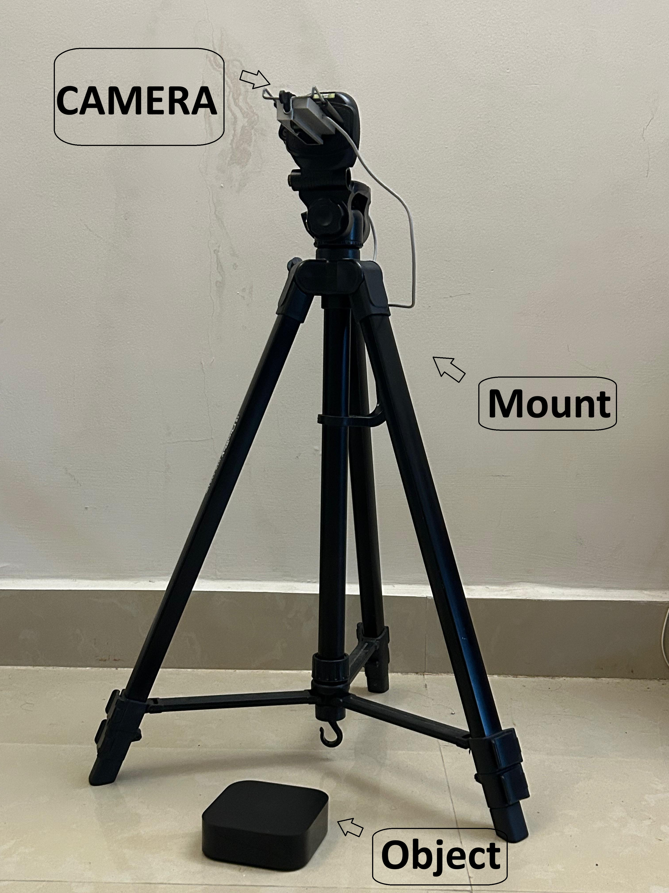
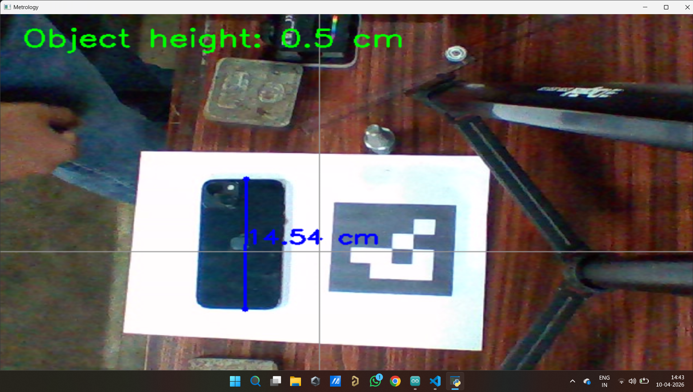
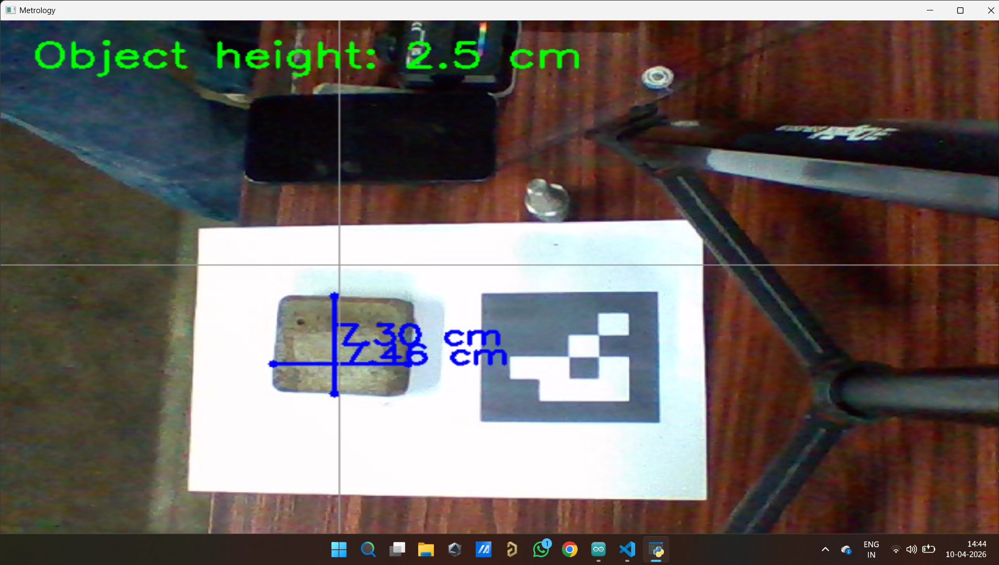
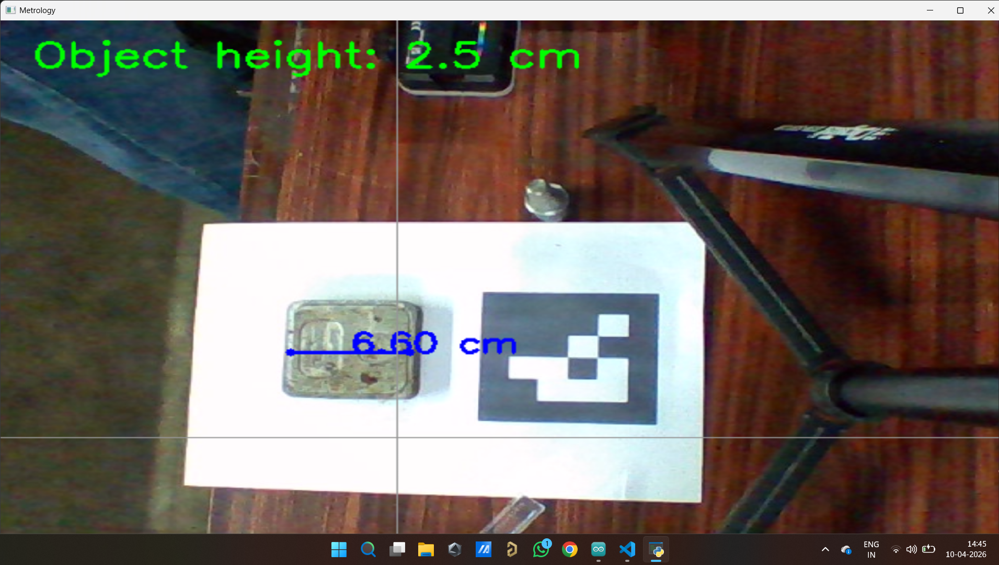
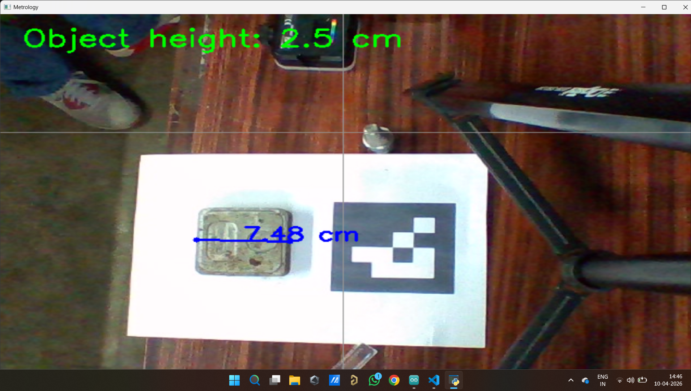
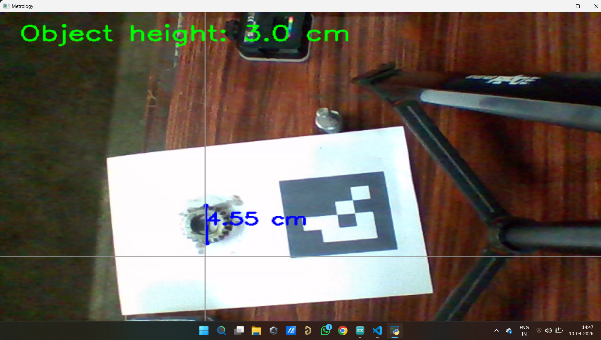

# 📷 OpenCV Monocular Metrology

A computer vision project that performs **real-world object measurement using a single calibrated camera**. The system uses camera calibration, perspective transformation, and monocular metrology techniques to estimate object dimensions accurately from images and live video.

---

# 📌 Overview

Monocular Metrology is the process of obtaining real-world measurements from a single camera by utilizing camera calibration and projective geometry.

This project demonstrates the complete pipeline from camera calibration to live measurement using OpenCV.

---

# ✨ Features

- 📷 Camera calibration using a chessboard pattern
- 📐 Camera intrinsic parameter estimation
- 🔍 Lens distortion correction
- 📏 Real-world object dimension estimation
- 🎥 Live webcam measurement
- 🖼️ Measurement from captured images
- 📐 Perspective transformation for improved accuracy

---

# 🛠 Technologies Used

- Python
- OpenCV
- NumPy
- Matplotlib

---

# 📂 Repository Structure

```
OpenCV-Monocular-Metrology
│
├── calibration/
│   ├── calib_capture.py
│   ├── calibration.py
│   └── undistort.py
│
├── measurement/
│   ├── Live_mes.py
│   ├── measure.py
│   ├── measure_plane.py
│   └── img_measure.py
│
├── docs/
│   └── Project_Report.pdf
│
├── images/
│
├── requirements.txt
├── README.md
├── LICENSE
└── .gitignore
```

---

# ⚙️ Working Pipeline

```
    Camera
      │
      ▼
Chessboard Calibration
      │
      ▼
Intrinsic Camera Matrix
      │
      ▼
Image Undistortion
      │
      ▼
Perspective Transformation
      │
      ▼
Object Detection
      │
      ▼
Pixel Measurement
      │
      ▼
Real-World Dimensions
```

---

# 📸 Demonstration

## Experimental Setup



---

## Sample Measurements

| Example | Result |
|---------|--------|
|  | Sample Measurement 1 |
|  | Sample Measurement 2 |
|  | Sample Measurement 3 |
|  | Sample Measurement 4 |
|  | Sample Measurement 5 |

---

# 📚 Methodology

## 1. Camera Calibration

A chessboard calibration pattern is used to estimate:

- Camera Matrix
- Distortion Coefficients
- Focal Length
- Principal Point

---

## 2. Image Undistortion

The calibration parameters are used to remove lens distortion before performing measurements.

---

## 3. Perspective Transformation

The image plane is transformed into a top-down view, allowing accurate scale estimation.

---

## 4. Object Measurement

Using the calibrated scale, object dimensions are computed from pixel distances and converted into real-world units.

---

# 🚀 Installation

Clone the repository

```bash
git clone https://github.com/NamitSingh-avi/OpenCV-Monocular-Metrology.git
```

Install the required libraries

```bash
pip install -r requirements.txt
```

---

# ▶️ Usage

Capture calibration images

```bash
python calibration/calib_capture.py
```

Run camera calibration

```bash
python calibration/calibration.py
```

Undistort images

```bash
python calibration/undistort.py
```

Run live measurement

```bash
python measurement/Live_mes.py
```

Measure from an image

```bash
python measurement/img_measure.py
```

---

# 📈 Applications

- Industrial inspection
- Manufacturing quality control
- Robotics
- Vision-guided automation
- Automated dimension estimation
- Computer vision research

---

# 🔮 Future Improvements

- ArUco marker-based measurements
- Stereo vision implementation
- YOLO-based automatic object detection
- Improved measurement accuracy
- GUI application
- Multi-camera support

---

# 📄 Documentation

A detailed technical report explaining the methodology, implementation, mathematical background, and experimental results is available in the **docs** folder.

---

# 👨‍💻 Author

**Namit Singh**

B.Tech Mechatronics Engineering

SRM Institute of Science and Technology

GitHub: https://github.com/NamitSingh-avi

---

# ⭐ If you found this project useful, consider giving it a star!
